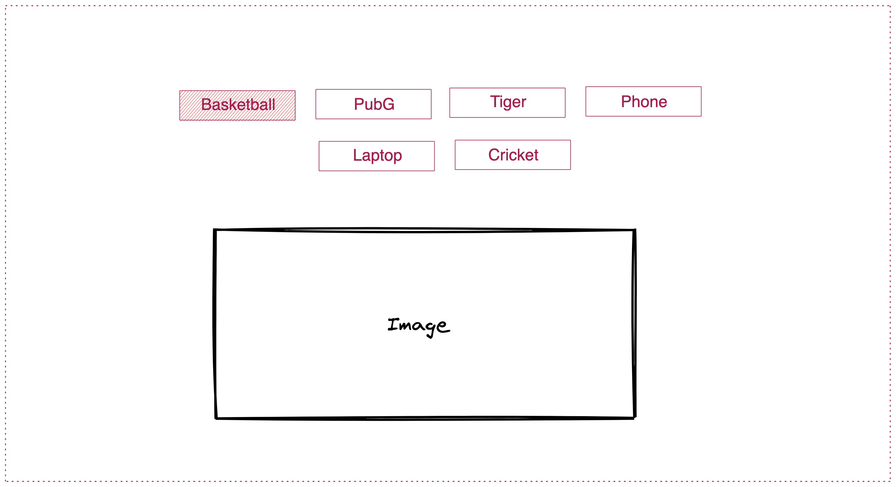

## Show Image

Take a look at the UI of the App:

- You need to create multiple buttons for different items with different names
- When user clicks on the button the respective image should be visible on the page
- You will all the required images in the `assets` folder
