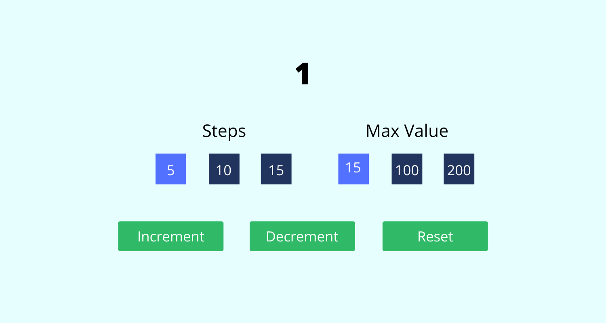

## Create a counter application

- Create a counter application with the initial counter value to be `0`
- It will have a steps functionality
- User will first select the steps either `5`, `10` or `15`.
- If user does not select the steps it should default to 1
- Once step is selected and user clicks on `Increment` the values of counter will change by step.
- Clicking on `Decrement` will decrease the value by step
- Clicking on `Reset` will reset the counter value to `0`

## Example:

- If user selects `5` as step
- Counter will start from `0`
- Clicking on `Increment` button will change counter to `5`
- Clicking on `Increment` button again will change counter to `10`
- Clicking on `Decrement` button will change counter to `5`
- Clicking on `Reset` button will change the counter value to `0`
- If step is not selected increment and decrement by 1

## App UI With Steps

## Extension II

In this extension we will add a new feature to our counter application. With this new feature will have a `max` value. Once max value is selected the value of counter will not exceed. By default it should be infinity.

For Example:

If user selected the `step` to be `5` and `max` to `15`. The value of counter should increment/decrement by 5 and should not exceed the `max` value.

## App UI With Steps and Max

