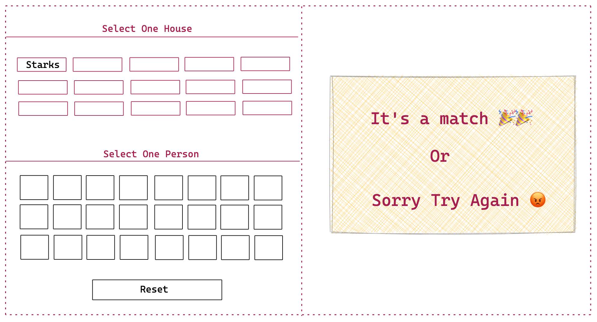

## GOT Match

Take a look at the UI of the App:

- You can find the data to be used in this application in the file `data.json`
- The app has two section. In one section you have to display the information and another you have show the result.
- Show all the house name below `Select one house`
- Show all the images of the people below `Select One Person`
- User has to select the name of the house and a person
- If the person belongs to the selected house
- Show a message `It's a match` otherwise shoe `Sorry Try Again`
- There will also be a reset button that will reset the game, so user can play again.
