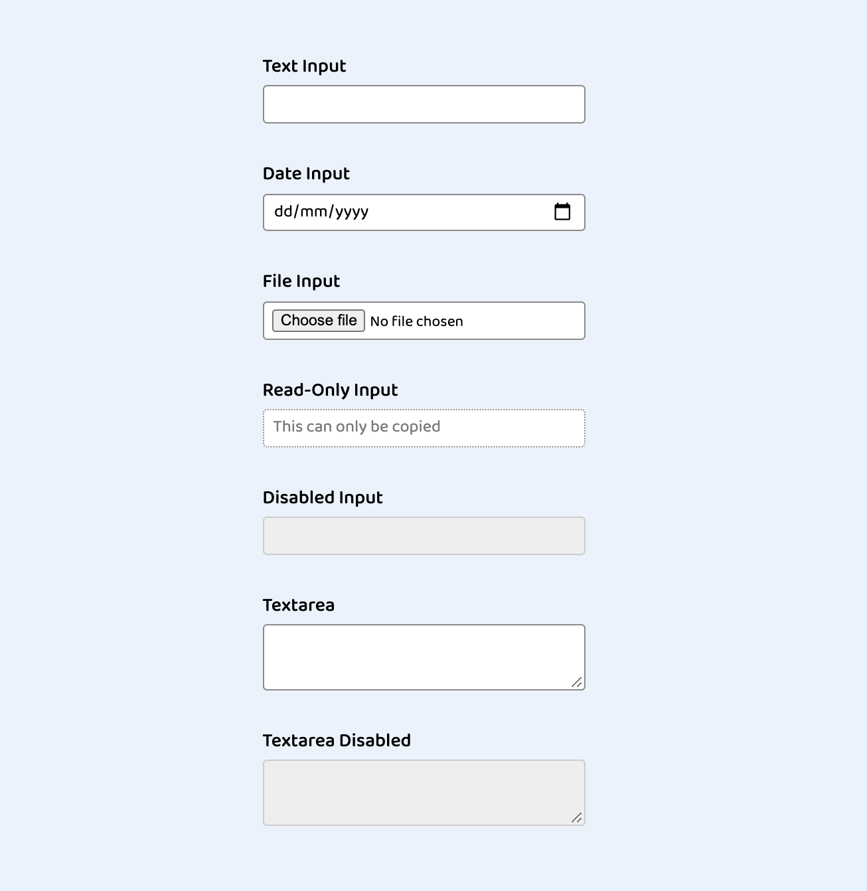

## Multiple Input Elements

Create a multiple input with all the different input types.

- Text Input (Input type text)
- Date Input (Input type date)
- File Input (Input type file)
- Read-Only Input (Input type text) use the special attribute `readonly`
- Disabled Input (Input type text)
- Textarea Input (Textarea)
- Textarea Input Disabled

## Form Validation (Create another component)

- Create another form and all the error message

